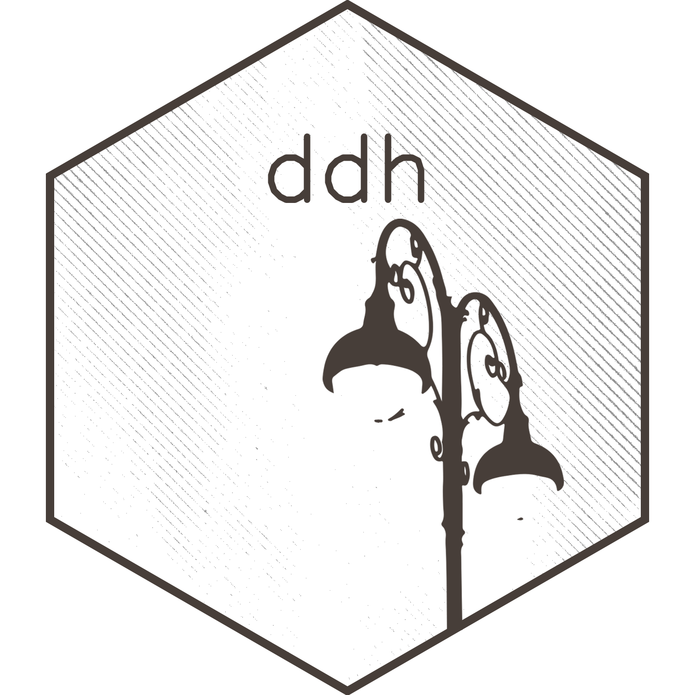

# Matthew Hirschey

2023 -

Founded [Heureka Labs](https://www.heurekalabs.co), building AI foundation models trained on multi-omic experimental data to help researchers find patterns in biological systems. Our desktop app, Heureka Bench, brings model querying, lab management, literature curation, and cloud compute into one place for organizing and analyzing scientific work.

2021 -

I am the inaugural Director of the Duke [Center for Computational Thinking](https://computationalthinking.duke.edu). The CCT is a University-wide initiative to make computational thinking part of every discipline. Programs, partnerships, and AI literacy work for students, faculty, and leadership across Duke.

2011 -

I joined the faculty of [Duke University](https://medicine.duke.edu) and started the [Hirschey Lab](https://www.hirscheylab.org), housed in the [Duke Molecular Physiology Institute](https://dmpi.duke.edu). The lab studies how cells integrate nutrient sensing and metabolism. I was promoted to tenured Associate Professor in 2019. I also hold a joint appointment at Duke-NUS in Singapore.

2006 - 2011

I did post-doctoral research with [Eric Verdin](https://en.wikipedia.org/wiki/Eric_Verdin) at the Gladstone Institutes at UCSF. I worked on mammalian sirtuins and the biology of aging.

2001 - 2006

My Ph.D. was in Chemistry & Biochemistry at UC Santa Barbara with [Alison Butler](https://labs.chem.ucsb.edu/butler/alison/). I combined inorganic semiconductor synthesis with microbiology, where I functionalized nanocrystals called quantum dots for new kinds of biological imaging.

1997 - 2001

B.S. in Biological Sciences at the University of Vermont, with research in mesoporous silica with [Chris Landry](https://www.uvm.edu/cas/chemistry/profile/christopher-c-landry) and glutathione metabolism with [Naomi Fukagawa](https://en.wikipedia.org/wiki/Naomi_Fukagawa).

------------------------------------------------------------------------

bio

Matthew Hirschey is a tenured Associate Professor at Duke University in the Departments of Medicine (Endocrinology, Metabolism & Nutrition) and Pharmacology & Cancer Biology, and a faculty member of the Duke Molecular Physiology Institute. Since 2021 he has been the inaugural Director of the Duke Center for Computational Thinking. His lab studies how cells integrate nutrient sensing and metabolism, using data-driven approaches to surface new regulatory pathways relevant to diabetes, cardiovascular disease, cancer, and aging. His work has appeared in *Nature*, *Science*, *Cell Metabolism*, and *Molecular Cell*, and is supported by the NIH, DOD, and OpenAI. He lives with his wife and children in Durham, NC.

  

    
featured talks

    

      

        2026
        BCG × QS: Workforce, AI, and the Future of Skills
        Washington, D.C.
      

      

        2025
        OpenAI Discussion with Sarah Friar (moderator)
        Duke University
      

      

        2025
        UseR! 2025 — Co-Organizer & Speaker
        Duke University
      

      

        2025
        International Symposium for Organelle Medicine
        Yonsei University, Korea
      

      

        2024
        Duke AI Summit
        Duke University
      

      

        2023
        10th Helmholtz Diabetes Conference
        Munich, Germany
      

      

        2022
        American Diabetes Association 82nd Annual Meeting
        New Orleans, LA
      

      

        2019
        Keystone: Mitochondria in Aging & Age-Related Disease
        Keystone, CO
      

    

  

teaching

At Duke I teach across the medical school, graduate programs, and undergraduate curriculum, with a consistent throughline: using biological data to tell a story. As Director of the [Center for Computational Thinking](https://computationalthinking.duke.edu), I also build programs that put computational thinking into the hands of students across every discipline.

- **CMB710 · TidyBiology** — An Introduction to Biological Data Science in R. A flagship course, taught yearly since 2019.
- **HSF · Human Structure & Function** — Medical student curriculum, metabolism/endocrinology modules.
- **MCB818 · Molecular Mechanisms of Oncogenesis** — Graduate cancer biology, 2022 – 2025.
- **MCB820 · Cancer Research from Concept to Translation** — 2026.
- **PCB710 · Grant Writing** — 2017 – 2022.
- **UNIV103 · Let’s talk about: Digital You** — An undergraduate seminar on identity and attention online.

writing

Most of my writing shows up in academic journals, but I also have an occasional blog — [**Heureka Labs**](https://www.heurekalabs.org) — with essays on creativity, computational thinking, and experiments in how we think.

A few selected pieces:

  

    
    <a href="https://www.heurekalabs.org/a-new-experiment/" class="wtitle">How do you come up with a new idea?</a>
    
On the mechanics of ideation and why the interesting question isn’t
“what should I work on” but “how did you decide what to try.”

  

  

    
    <a href="https://www.heurekalabs.org/sell-the-sawdust/" class="wtitle">Sell the sawdust</a>
    
On the byproducts of research and the overlooked value hiding in the
scraps of what you’re already doing.

  

  

    
    <a href="https://www.heurekalabs.org/why-learn-to-program/" class="wtitle">Why you need to learn to program</a>
    
The case for programming as a thinking tool, not a job skill — for
scientists, students, and pretty much everyone else.

  

  
projects

  

    

    

      <a href="https://www.datadrivenhypothesis.com"><b>Data-Driven Hypothesis</b></a> — A web tool that integrates DepMap, expression, and literature data to
suggest functions for understudied genes. Pairs with the pathway
co-essentiality work in the lab. Preprint on bioRxiv, 2026.
    

    

  

selected publications

A curated list. For the full record (nearly 100 papers, books, and chapters) see the [CV](Hirschey_CV.pdf).

Pathway Coessentiality Mapping Reveals Complex II is Required for de novo Purine Biosynthesis in Acute Myeloid Leukemia. Stewart AE\*, Zachman DK\*, Castellano-Escuder P, et al. Nature Metabolism (2025, in press)

Interpretable multi-omics integration with UMAP embeddings and density-based clustering. Castellano-Escuder P, Zachman DK, Han K, Hirschey MD. Nature Communications (2025) 16:5771

Cysteine S-acetylation is a post-translational modification involved in metabolic regulation. Keenan EK, Bareja A, Lam Y, Grimsrud PA, Hirschey MD. Nature Metabolic Health & Disease (2025) 3:43

Statin therapy inhibits fatty acid synthase via dynamic protein modifications. Trub AG, Wagner GR, Anderson KA, et al. Nature Communications (2022) 13:2542

The Growing Landscape of Protein Modifications. Keenan EK, Zachman DK, Hirschey MD. Molecular Cell (2021) 81(9):1868-1878

Creating An Environment For A Distributed Scientific Workforce. Hirschey MD. Nature (2020) 582:184

SIRT4 is a Lysine Deacylase That Controls Leucine Metabolism and Insulin Secretion. Anderson KA, Huynh FK, Fisher-Wellman K, et al. Cell Metabolism (2017) 25(4):838-855

A Class of Reactive Acyl-CoA Species Reveals the Nonenzymatic Origins of Protein Acylation. Wagner GR, Bhatt DP, O’Connell TM, et al. Cell Metabolism (2017) 25(4):823-837

Role of NAD⁺ and mitochondrial sirtuins in cardiac and renal diseases. Hershberger KA, Martin AS, Hirschey MD. Nature Reviews Nephrology (2017) 13(4):213-225

Non-enzymatic protein acylation as a carbon stress regulated by sirtuin deacylases. Wagner GR, Hirschey MD. Molecular Cell (2014) 54(1):5-16

Lysine Glutarylation Is a Protein Post-Translational Modification Regulated by SIRT5. Tan M\*, Peng C\*, Anderson KA\*, et al. Cell Metabolism (2014) 19(4):605-617

Suppression of Oxidative Stress by β-Hydroxybutyrate, an Endogenous Histone Deacetylase Inhibitor. Shimazu T, Hirschey MD, Newman J, et al. Science (2013) 339:211-214

SIRT3 Deficiency and Mitochondrial Protein Hyperacetylation Accelerate the Development of the Metabolic Syndrome. Hirschey MD, Shimazu T, Jing E, et al. Molecular Cell (2011) 44:177-190

SIRT3 Deacetylates Mitochondrial HMG-CoA Synthase 2 and Regulates Ketone Body Production. Shimazu T\*, Hirschey MD\*, Ha L, et al. Cell Metabolism (2010) 12:654-661

SIRT3 regulates mitochondrial fatty acid oxidation via reversible enzyme deacetylation. Hirschey MD, Shimazu T, Goetzman E, et al. Nature (2010) 464:121-125

misc

- I make [art](https://foundation.app/matthewhirschey) when I want to create.
- Currently learning: how to teach computational thinking to people who have never written a line of code and don’t plan to.
- If you’re a prospective trainee: start with the [lab site](https://www.hirscheylab.org).
- Eagle Scout.

